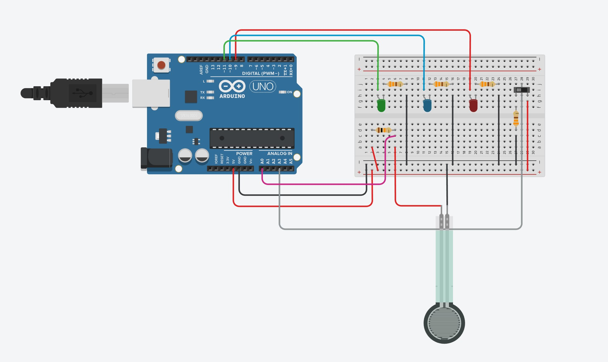
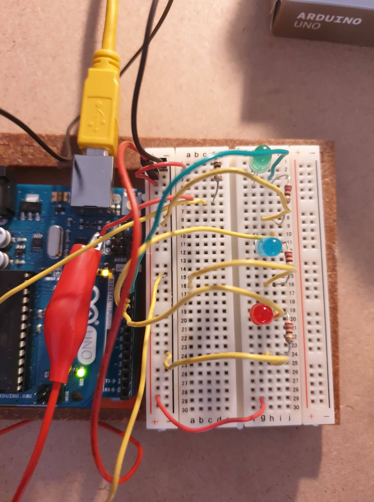
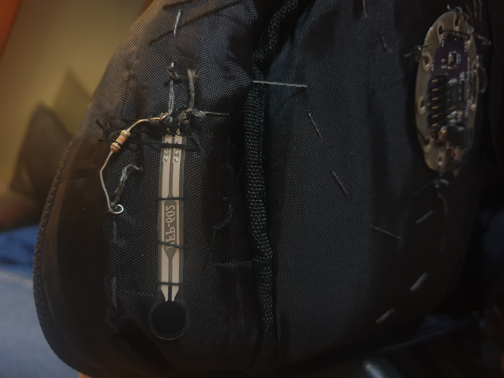
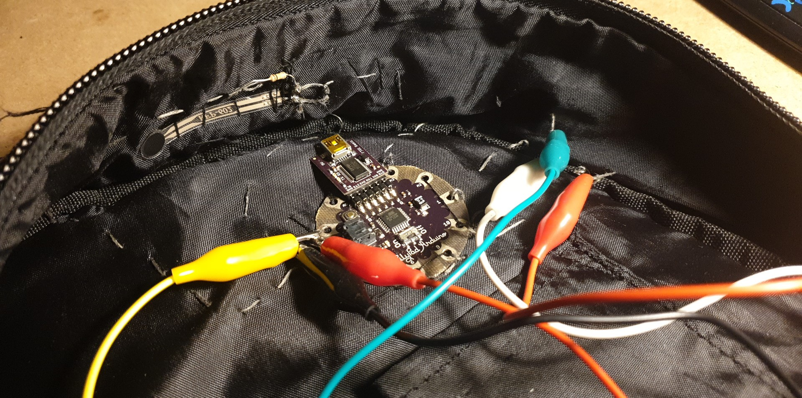
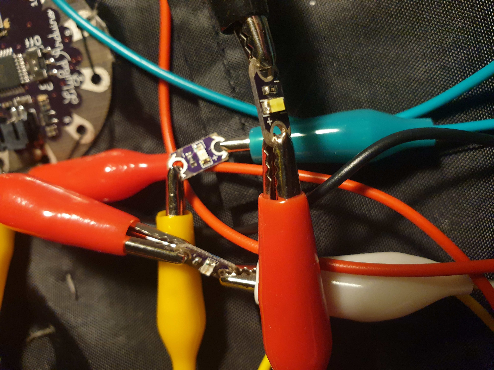

# Lesson: Interaction Design

|**First and Last Name:** | DESPOTIDOU EVANGELIA | ZOGOPOULOS SOTIRIOS | CHARISIS LALOPOULOS |
| :----- | :--------: | :--------------------: | :---------------: |
|**University Registration Number:** | DPSD19030 | DPSD19040 | DPSD19064 |
|**GitHub Personal Profile:** | [EvelinaDespotidou](https://github.com/Evedes01) | [sotoszogos](https://github.com/sotoszogos) | [CharisisLalopoulos](https://github.com/CharisisLalopoulos)

# Introduction 
>### D E S I G N _ B R I E F :
Δημιουργία ενός έξυπνου σακιδίου που θα μετράει το βάρος του περιεχομένου και θα εκφράζει με τις ανάλογες ενδείξεις την καταλληλότητά του για την αποφυγή καταπόνησης του σώματος του χρήστη.
  
***Thematic Area***
 E-Textiles

# Summary
Ένα σύνηθες πρόβλημα που αντιμετωπίζουν τα μικρά παιδιά στα πρώτα τους χρόνια στο σχολείο, 
είναι το γεγονός οτι καλούνται να μεταφέρουν την σχολική τους τσάντα, που τις περισσότερες φορές είναι πολύ πιο βαριά απο αυτό που
μπορούν να κουβαλήσουν. Τα αποτελέσματα αυτής της κατάστασης μπορούν να είναι μόνο αρνητικά, αφού οι χρήστες μας επιβαρύνουν το σκελετικό τους σύστημα. 
'Ετσι με το προϊόν μας θέλουμε να βοηθήσουμε τους χρήστες μας να μπορούν να ελέγξουν το πόσο βαριά είναι η τσάντα τους, με στόχο να αποφύγουν τραυματισμούς 
ή χρόνια προβλήματα στο σώμα τους. 
# 1st Deliverable
>### R E S E A R C H :
**PEOPLE:** 
- ***Physical Characteristics:***
  - Ηλικία: 6-9 ετών
  - Βάρος: 20-30 κιλών (με απόκλιση 2 κιλών)
  - Ύψος: 120-130 εκατοστά
- ***Psycological Characteristics:*** -
- ***Social Characteristics:*** Μαθητές 1ης-3ης Δημοτικού
- ***Cultural Differences:*** -
- ***Culture:*** Ευρωπαϊκή κουλτούρα
- ***Special Needs:*** -
- ***Frequent Users***
- ***Ergonomics:*** Μπορούν να σηκώσουν το 1/6 (περίπου το 15%) του βάρους τους

  
**ACTIVITIES:** Στην τρέχουσα κατάσταση οι χρήστες μας γεμίζουν την σχολική τους τσάντα χωρίς να γνωρίζουν το συνολικό βάρος του φορτίου και το επιτρεπόμενο βάρος για το σωματότυπό τους, με αποτέλεσμα να καταπονούνται διάφορα σημεία του σώματος αλλά και να δημιουργούνται χρόνια προβλήματα στην σπονδυλική τους στήλη (πχ. σκολίωση, οσφυαλγία, κύφωση). 
- ***Temporal:***
  - Frequency: *Καθημερινή χρήση*
  - Duration: *Max 5 λεπτά*
  - Continiuty: *Διακοπτόμενο*
  - Responce time: *Άμεσος*
- ***Co-operation: -***
- ***Complexity:***
 Η περιπλοκότητα του συστήματος είναι μικρή, αφού όλα τα χαρακτηριστικά του(Διακόπτης, Lilypad, Piezo, LED) συνδέονται μεταξύ τους με αγώγιμη κλωστή 
- ***Safety Critical:***
 Το σύστημα είναι αρκετά ασφαλές, αφού έχει απλές συνδέσεις και δεν υπάρχει κίνδυνος ηλεκτροπληξίας λόγω αμελητέας ποσότητας ρεύματος.

  
**CONTEXTS:**
- ***Physical Context:***
  - Εσωτερικοί χώροι (πχ. σπίτι, σχολείο κλπ)
  - Εξωτερικοί χώροι (πχ. προαύλιο, άλλοι δημόσιοι χώροι)
  - Οι καιρικές συνθήκες δεν επηρεάζουν την χρήση του αντικειμένου
 - ***Social Context:***
  - Το σύστημα θα είναι ενσωματωμένο στην τσάντα, η οποία δεν θα βρίσκεται πάντα σε ένα σημείο 

  
**TECHNOLOGIES:** Lilypad (programming), Force sensor, 3 LED (red, blue, green).
- ***Input:***
 Η τοποθέτηση των βιβλίων μέσα στην τσάντα θα εισάγει τα δεδομένα βάρους στον αισθητήρα βάρους
 Άνοιγμα και κλείσιμο του διακόπτη για την έναρξη και τη λήξη του συστήματος αντίστοιχα.

- ***Output:***
 Ανάλογα με το βάρος των βιβλίων θα ανάβει το αντίστοιχο χρώμα του 3 LED (red, blue, green).
  - Πράσινο    >  Κατάλληλο βάρος
  - Μπλε  >  Οριακό βάρος
  - Κόκκινο    >  Ακατάλληλο βάρος (μεγάλη καταπόνηση της πλάτης του παιδιού) 

- ***Communication:***
 Το σύστημα ανίχνευσης βάρους επικοινωνεί την καταστασή του με τον χρήστη μέσω του 3 LED (red, blue, green). (οπτικοποίηση)

# 2nd Deliverable
>### I N F O R M A T I O N _ A R C H I T E C T U R E :

>### U S E R _ I N T E R A C T I O N :
Αρχικά ο χρήστης θέτει το σύστημα σε λειτουργία ανοίγοντας τον διακόπτη. Στη συνέχεια τοποθετεί τα βιβλία στην σχολική τσάντα και ανάλογα τον αριθμό των βιβλίων και το βάρος τους λαμβάνει μία οπτική πληροφορία από το σύστημα. Η οπτική πληροφορία αυτή πρόκειται για τα LED φώτα στο μπροστινό μέρος της σχολικής τσάντας που σηματοδοτούν την καταλληλότητα του βάρους σε σχέση με το τυπικό σωματότυπο ενός παιδιού μεταξύ 6-9 ετών.
- Αν το κόκκινο φωτάκι ανάψει, τότε ο χρήστης αρχίζει τη διαδικασία της αφαίρεσης βιβλίων από την τσάντα μέχρι το πράσινο ή το μπλε φωτάκι να ανάψει.
- Αν το πράσινο ή το μπλε φωτάκι ανάψουν εξαρχής, τότε ο χρήστης μπορεί να προχωρήσει στην ολοκλήρωση της διαδικασίας. 

Αφού ολοκληρωθέι η διαδικασία γεμίσματος της τσάντας, ο χρήστης κλείνει τον διακόπτη και παύει η λειτουργία του συστήματος. (Οπτικά: Σβήνουν οι φωτεινές ενδείξεις)

# 3rd Deliverable 
>### S C E N A R I O S :

**Scenario 1:**
 
Ο χρήστης τοποθετεί τα βιβλία στην τσάντα και απευθείας το σύστημα του εμφανίζει ένα πράσινο φως (καθώς το βάρος είναι κατάλληλο για το παιδί).
 
 
**Scenario 2:**
 
Ο χρήστης τοποθετεί τα βιβλία στην τσάντα και απευθείας το σύστημα του εμφανίζει ένα πράσινο φως (καθώς το βάρος είναι κατάλληλο για το παιδί) και ο χρήστης επιλέγει να προσθέσει κι άλλα αντικείμενα μέσα στην τσάντα.
 
 
**Scenario 3:**
 
Ο χρήστης τοποθετεί τα βιβλία στην τσάντα και απευθείας το σύστημα του εμφανίζει ένα μπλε φως (καθώς το βάρος βρίσκεται στο όριο καταλληλόλητας), έτσι ο χρήστης δεν προσθέτει άλλα αντικείμενα.
 
 
**Scenario 4:**
 
Ο χρήστης τοποθετεί τα βιβλία στην τσάντα και απευθείας το σύστημα του εμφανίζει ένα μπλε φως (καθώς το βάρος βρίσκεται στο όριο καταλληλόλητας), έτσι ο χρήστης επιλέγει να αφαιρέσει αντικείμενα.
 
 
**Scenario 5:**
 
Ο χρήστης τοποθετεί τα βιβλία στην τσάντα και απευθείας το σύστημα του εμφανίζει ένα κόκκινο φως (καθώς το βάρος βρίσκεται πέρα από το όριο καταλληλόλητας), έτσι ο χρήστης αρχίζει να αφαιρεί αντικείμενα μέχρι το φως να γίνει μπλε ή ακόμα καλύτερα πράσινο.
 
 
**Scenario 6:**
 
Ο χρήστης τοποθετεί ένα-ένα τα βιβλία στην τσάντα και παράλληλα το σύστημα του εμφανίζει ένα πράσινο φως, και σταδιακά ο χρήστης επιλέγει να προσθέσει κι άλλα αντικείμενα μέσα στην τσάντα, μέχρι να εμφανιστεί η μπλε ένδειξη, όπου και σταματάει.
  
>### S T O R Y B O A R D :

  
>### P R O T O T Y P I N G :

Αρχικά πρίν ξεκινήσουμε με την προτοτυποποίηση φτιάξαμε το κύκλωμα μας στο Tinkercad > [Team Assignment](https://www.tinkercad.com/things/b6mycFduaCB-team-assignment/editel?sharecode=LQttA-oZxhUYwuRlR0R5wnw91GAZ4TWs1ICrqUoAKwg) .
  

  
Στη συνέχεια αφού είδαμε ότι δουλεύει κανονικά, δανειστήκαμε το Arduino των [Partners In Crime](https://github.com/MaritettaKatsarou/Interaction-Design-Project-Assignment) και φτιάξαμε το κύκλωμα εκεί, μιας και ήταν πιο εύκολη η μεταφορά του από τον ψηφιακό κόσμο στον πραγματικό, αφού στο Tinkercad υπάρχει μόνο η πλατφόρμα 
του Arduino και όχι και αυτή του Lilypad.
  

  
Screenshot από το σχετικό βίντεο :
  

  
Έπειτα αφού δούλεψε κανονικά στο Arduino, μεταφέραμε το κύκλωμα στο Lilypad μας. Στη συγκεκριμένη περίπτωση αντιμετωπίσαμε μερικά θέματα με τη συνδεσιμότητα, όσων αφορά τη αντίσταση και τον αισθητήρα πίεσης.
  

  
Εδώ παρέχεται το σχετικό βίντεο, όπου ο αισθητήρας λειτουργεί κανονικά και ανάλογα την πίεση (αντιστοιχία βάρους) ανάβει και διαφορετικό LED:
  

https://user-images.githubusercontent.com/100956819/174143454-42111cf6-ecf7-4038-b61e-90472da5b094.mp4

  
Τέλος, το ράψαμε στην τσάντα, αλλά δυστυχώς αντιμετωπίσαμε προβλήματα με το κύκλωμα και δεν υπήρχε σωστή κατανομή του ρεύματος, με αποτέλεσμα να μήν λειτουργεί σωστά το τελικό πρωτότυπο.
  

  
***Σημείωση: Για πρακτικούς λόγους αποφασίσαμε να χρησιμοποιήσουμε ένα RGB LED, αντί για 3 διαφορετικά Led***
# Conclusions
Το πρότζεκτ αυτό ήταν μια ενδιαφέρουσα μαθησιακή εμπειρία, το hands-on βοηθάει στην κατανόηση του θέματος και κάνει το μάθημα πιο ενδιαφέρον. Παρ'όλο που δεν διαθέταμε καμία εμπειρία σχετικά με το Arduino/LilyPad και τα κυκλώματα, προσπαθήσαμε, και με βοήθεια από τα εργαστήρια και διαδικτυακή έρευνα, να φέρουμε εις πέρας ένα πρότζεκτ, που θα είχε και πρακτική χρήση. Σίγουρα, αυτή η εργασία βοήθησε να βελτιώσουμε τις ικανότητες μας σε έναν τομέα που δεν είχαμε ιδιαίτερη τριβή ως τώρα. Αν και δεν καταφέραμε να υλοποιήσουμε το πρωτότυπο (πάνω στην τσάντα), είμαστε ικανοποιημένοι με την πρόοδο που κάναμε, καθώς λειτούργησε κανονικά και στο Arduino και στο LilyPad.

# Sources
- [Using a LilyPad & Pressure Sensor](https://www.instructables.com/Using-a-LilyPad-Pressure-Sensor-to-Monitor-Bird-Fo/)
- [Conductive Thread Pressure Sensor](https://www.instructables.com/Conductive-Thread-Pressure-Sensor/)
- [Glow Pillow with Force Sensing Resistor](https://create.arduino.cc/projecthub/rachel-fagan/glow-pillow-with-force-sensing-resistor-904229)
- [Backpack Weight Sensor](https://www.hackster.io/prabhuta/backpack-weight-sensor-c1e82b)
